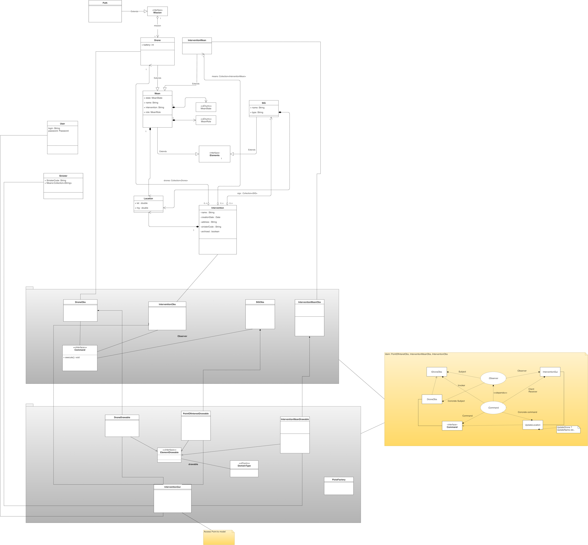
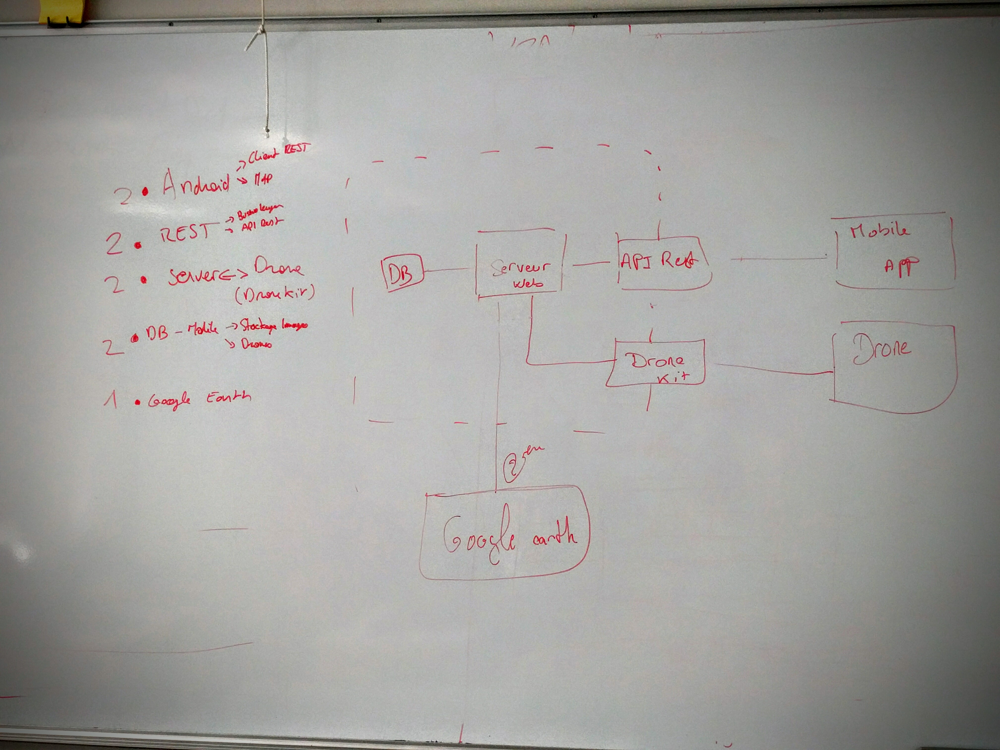
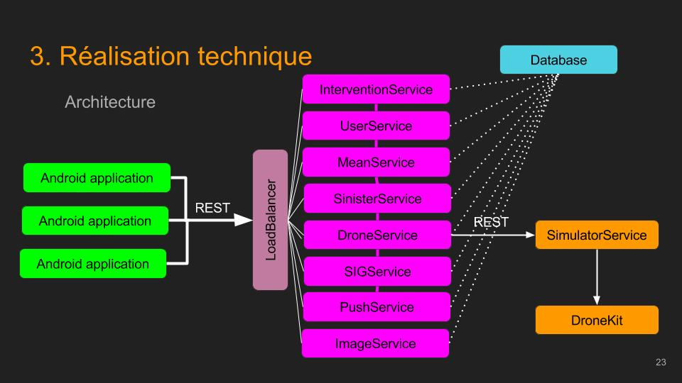
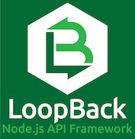
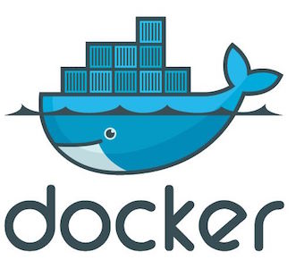

# Rapport de conception
_Projet Drone Fireman_

## Introduction

Drone Fireman est une application destinée aux Sapeurs-Pompiers d'Ille et Vilaine. Elle vise à reproduire un Système d'Intervention Tactique (SITAC) sur des tablettes tactiles, à la disposition des forces de sécurité en intervention. Ces tablettes doivent donc être toujours synchronisées. De plus, le matériel utilisé en intervention est imposé.

## Analyse préliminaire

Afin de clarifier notre vision commune du projet, nous avons commencé par analyser les User Stories afin d'en dégager les entités. Nous avons ensuite materialisé cette analyse par deux diagrammes UML, de cas d'utilisation et de classes.

Enfin, nous avons découpé la solution en différents tiers et défini les responsabilités de chacun de ces tiers.

### Analyse des user stories

Nous avons commencé par comprendre les différentes User Stories du premier sprint afin d'en comprendre les différents éléments et contraintes.

Nous avons ainsi identifié une première contrainte en terme de connectivité. En effet, la possibilité qu'une intervention ait lieu en un point non couvert pas le réseau mobile posait la question d'un réseau local. Cette contrainte a cependant été levée par le client qui a retiré cette question de nos prérogatives.

Ensuite, une contrainte materielle a été soulevée. Les tablettes utilisée par les intervenants utilisent une version datée d'Android. Le développement devait donc prendre en compte ce point.

Dans cette phase de conception, l'équipe a eu tendance à anticiper de futures demandes du client dont nous n'avions pas encore connaissance. Il en a résulté une approche très modulaire et une grande prudence quant aux futures demandes du client. Ces demandes n'ont pas eu lieu, ce qui d'un aspect purement pragmatique a consommé du temps inutilement. Cependant, cet aspect modulaire rend le projet plus évolutif.

### Analyse UML

Nous avons commencé par dresser un diagramme de cas d'utilisation, afin de distinguer les différents acteurs. Nous avons identifié deux types d'utilisateurs : le CODIS et l'équipier.

Ensuite, dans le but d'obtenir un référentiel de nommage commun, nous avons esquissé un modèle de données commun à toute l'application.

### Architecture globale

Suite à l'analyse des User Stories, nous avons fait le choix de découper la solution en trois tiers:

* L'application Android : Client utilisé par les intervenants pour interagir avec le système
* Le serveur d'API : Application communiquant avec Android et avec le Drone. Il gère également le stockage des données.
* L'interface Drone : Synchronise et pilote les drones.

Les différents tiers communiquent entre eux par le biais de services REST. Nous avons choisi REST car contrairement à SOAP ou aux Websockets, REST est un standard compatible avec beaucoup de technologies, et il est maîtrisé par la plupart des membres de l'équipe.

La synchronisation des tablettes implique un moyen pour le serveur d'envoyer des informations au client. Nous avons donc pris en compte un système de Push.

## Choix techniques de  l'API

### Architecture

Afin de réaliser notre API, nous avons choisi une architecture en microservices. En effet, cette architecture permet de découpler les fonctionnalités de l'API et autorise à celle-ci de continuer à fonctionner malgré d'éventuelles défaillances.

Ces microservices utilisent cependant une base de données commune, permettant à ceux-ci d'utiliser les mêmes données.

Enfin, les microservices seront répartis entre eux via un load balancer.

### Technologies

Concernant les technologies à utiliser pour l'API, l'emploi de MongoDB a été imposé par le client. Nous avons donc articulé notre choix de technologies autour de cette contrainte.

Nos analyses se sont portées sur deux possibilités de technologies:

* J2E, en utilisant la stack SpringBoot
* NodeJS, en utilisant une stack type Express

Notre choix s'est porté sur NodeJS, car il s'agit d'une technologie performante et désormais mature en terme de librairies, de frameworks et de documentation. De plus, le format de données Json, utilisé par MongoDB, correspondait mieux à un langage Javascript qu'à un langage Java. Enfin, ce choix a permis à certains membres de l'équipe de monter en compétences sur le Javascript serveur.

En complément de NodeJS, nous avons utilisé Forever qui nous a permis d'obtenir une meilleure robustesse et de maximiser l'uptime.

### Communication avec les clients

Pour que les 3 tiers de l'application communiquent, nous avons du choisir une norme de communication. Notre choix s'est porté sur des requêtes HTTP utilisant la norme REST. En effet, cette méthode est compatible avec les technologies choisies et maitrisée par toute l'équipe.

### Framework

Pour accélerer nos développements, nous avons décidé d'utiliser un Framework. Notre choix s'est porté sur Loopback. Ce framework a plusieurs outils interessants qui nous ont permis de gagner du temps:

* Génération automatique des endpoints REST : Sur la base d'un fichier de description, Loopback crée automatiquement les endpoints CRUD d'un service.
* Prise en charge transparente des sources de données : Par le biais d'une couche d'abstraction de données, il est possible d'utiliser de multiples bases de données, dont MongoDB.
* Gestion des environnements : Loopback gère différentes configurations selon l'environnement dans lequel il est déployé
* Génération automatique de la documentation : Grâce à Swagger, Loopback permet de gérer la documentation automatiquement.

## Choix techniques des drones

### Outils

* MavLink

### Simulation

MAVLink est le protocole utilisé pour communiquer entre un drone et une station de commande.

* SITL : Pour la partie drones, nous avons utilisé le simulateur SITL (Software in the Loop) qui va nous permettre de faire fonctionner sur notre pc, le microcontrôleur de type ArduPilot.Aussi nous lui avons ajouter le module MAVProxy qui va nous servir comme debeugeur grâce à son invite de commande qui nous permet d'envoyer des commande MAVLink, et la map qui  grâce à elle, on peut voir le déplacement du drone.

* dronekit-python : Pour contrôler le drone, nous avons  utilisé la librairie dronekit-python mise à la disposition des développeurs par l'entreprise américaine 3D Robotics, cette librairie permet de :
  - Faire fonctionner SITL d'une manière rapide et simple.
  - Contrôler le drone par des scripts python.
* Python : Les scriptes de contrôle du drone, écrites en python, permettent de :
 - contrôler le déplacement du drone.
 -  Mettre à jour la position du drone grâce à une api rest.
 - Mettre à jour la photo grâce à une autre api rest.

* Google Earth : la prise de la photo est faite par une capture d'écran du Google Earth.

L'utilisation du python pour le simulateur était motivé par la librairie fournie dans ce language par le constructeur des appareils du client (3D robotics). Pour rester dans la logique de notre architecture, nous avons fait le choix de rendre les ordres de missions ainsi que la création d'une nouvelle instance de drone accessible par une interface REST. L'utilisation de la librairie python __Flask__ nous a permis de mettre en place rapidement le serveur REST. Toute modification de la position du drone était par la suite répercuté de manière transparente via le service REST de gestion des drones en base de données.

## Choix techniques de l'application Android

### Architecture

Concernant Android, les fragments étant supportés sur la version qui nous était imposée, nous avons fait le choix de n'utiliser que des fragments encapsulés dans des activités. Cela nous a permis, notamment sur tablette, d'avoir plus de modularité dans les écrans et dans les responsabilités de chaque composant.

De plus, nous avons opté dans la première semaine pour la mise en place d'une injection de dépendances, après avoir remarqué l'instanciation parfois laborieuse et répétitive de certains composants.

Pour les besoins de l'affichage des pictogrammes sur la carte, nous avons créé une factory. Celle-ci permet de générer, à partir des propriétés d'un point, un drawable affichable sur la carte.

En ce qui concerne la Toolbar (barre d'outils sur la gauche), nous avons eu recours à un design pattern de type commande. Il en va de même pour la classe gérant les réceptions de Push.

L'accès aux données se fait via une couche d'accès aux données qui prend à la fois en charge les appels REST à l'API et la persistance des données en local.

Enfin, la gestion du Push se fait par un PushHandler. Cet Handler prend des commandes à exécuter lors de la réception de push sur un topic particulier.

### Technologies

Conformément aux prérequis du projet, nous avons utilisé le SDK Android API 15, auquel nous avons rajouté la librairie AppCompat de Google nous permettant d'utiliser certaines fonctionnalités plus modernes, telles que l'ActionBar.

L'injection de dépendances décrite précedemment aurait pu être réalisée avec Guava, qui fut l'outil choisi dans un premier temps. Nous l'avons remplacé par Dagger2 qui est la librairie recommandée par Google pour Android, car elle ne fait pas appel à de la réflectivité et économise donc la batterie. Nous avons par ailleurs fait appel à un autre système d'injection nommé ButterKnife pour injecter les composants UI dans les activités par le biais d'annotations.

En ce qui concerne l'affichage de cartes, nous avions initalement choisi d'utiliser OSMDroid, lui même basé sur OpenStreetMaps. Cette librairie nous liberait d'une dépendance envers Google et nous permettait d'utiliser un code ouvert et libre. Cependant, au vu des performances supérieures du SDK Google Maps, et de certains crashes survenus à cause d'OSM Droid, nous avons du nous résoudre à passer sur la librairie Google Maps.

La DAO a été réalisée avec l'aide de trois librairies.

Tout d'abord, Square OkHttp qui nous a permis de réaliser facilement des requêtes HTTP, puis Gson qui a serialisé/déserialisé le contenu de ces requêtes. Cette partie d'intérogation REST aurait pu être réalisée avec d'autres librairies plus haut niveau telles que Retrofit ; mais celles-ci ne permettaient pas de rendre les appels aussi génériques que nous l'avons fait.

Enfin, la DAO a fait appel à DBFlow pour la persistance en base de données. Il s'agit d'un ORM léger qui permet d'abstraire la persistance ou la récupération d'entités depuis la base locale. Cet ORM nous a encore une fois donné la possibilité de rendre le système très générique.

## Qualité

### Tests unitaires

La base nécessaire à l'exécution de tests unitaires a été mise en place, aussi bien au niveau de l'API qu'au niveau de l'application Android.

Pour l'API, LoopBack recommande l'utilisation de Mocha, Chai, et SuperTest qui sont installés par défaut. Il s'agit d'outils de tests unitaires et de mocking en NodeJS.

Concernant l'application Android, nous avons utilisé JUnit pour réaliser des tests unitaires locaux ainsi que des tests unitaires "instrumentés". Les tests unitaires locaux ne font pas appel au contexte d'exécution Android, à l'inverse des tests instrumentés.

De manière générale le nombre de tests, et donc la couverture de code, est très faible. Nous avons préféré consacrer le peu de temps hors développement dont nous disposions à la conception préalable plutôt qu'à la chronophage rédaction de tests. Cependant, les bases de la rédaction de ces tests sont posées, ceux-ci sont intégrés à la chaine d'intégration continue, et si de futurs sprints étaient demandés, il serait aisé de développer les tests déjà existants.

### Tests d'intégration

Supervisés par Jenkins, des appels de tests sont fait régulièrement sur l'API afin de s'assurer de son bon fonctionnement.

### Documentation

La documentation de l'API est générée par LoopBack et disponible au sein d'un composant Swagger. Cette documentation permet également la réalisation de requêtes depuis le navigateur internet.

L'application Android utilise quant à elle la JavaDoc, générable depuis une tâche gradle. La documentation est disponible au sein du répertoire doc/ du projet.

### Intégration continue

#### Jenkins

Nous avons très rapidement mis en place Jenkins, afin de disposer d'une solution d'intégration continue. Celui-ci nous a permis d'instaurer des normes de qualité dès le début et de garder un contrôle sur l'état du code, tout enn nous fournissant une évolutivité pour les éventuelles versions futures.

##### Tâches

Afin de rapidement identifier quelle phase de la construction de l'application était mise en échec, et par soucis de séparation des préoccupations, nous avons divisé la construction de chaque entité en quatre phases :
 - Build
 - Analyse
 - Test
 - Deploy

###### Build
Habituellement, cette phase serait réservée à la compilation du code source.
otre code coté serveur étant en Javascript, aucune compilation n'est requise.
Nous nous contenterons ici de résoudre les dépendances npm. Cette phase est actionnée par un évènement depuis **Github**. Cet évènement, appellé *Webhook*, est déclenché lors d'un nouveau commit sur le dépot.

###### Analyse
Loopback, le framework utilisé pour nos APIs, intègre nativement jshint, un outil d'analyse statique de code Javascript permettant de s'assurer que l'on respecte certaines normes lors de l'écriture du code.
Nous n'avions plus qu'à ajuster les règles de jshint pour disposer d'un code uniformisé, plus facile a maintenir dans le temps.
###### Test
Grâce à npm, il était très facile d'automatiser nos tests. Nous n'avions qu'a choisir et ajouter un framework pour disposer de test automatisés. Tout comme pour jshint (voir Analyse), Loopback dispose par défaut de nsp (qui permet d'effectuer des audits de sécurité), nous ne nous sommes pas particulièrement renseigné sur les capacités de cet outil, il est néanmoins intéressant de savoir que notre application est en permanence surveillée, nous évitant ainsi toute mauvaise surpris.
###### Deploy
Disposant de deux environnements, un dédié au developpement et un dit de production, il nous fallait déployer nos services sur ces serveurs.
Nous avons fait le choix d'un déploiement continue sur notre environnement de développement afin de bénéficier au plus vite de la dernière version. Ce choix nous a permis d'augmenter de façon significative la rapidité à laquelle un développement serveur était testable depuis l'application android sur une tablette.
L'environnement de production ayant pour but d'être stable et de ne pas pénaliser l'équipe android, lorsqu'une nouvelle version d'un service est installé sur l'environnement de développement qui les concerne pas par exemple), nous avons opté pour un déploiement "manuel". Heureusement, Jenkins ne nous laisse pas totalement tomber. En effet, nous avons mis en place un système dit de "one-click deployment", qui nous permet d'installer la dernière version d'un service en un simple clic de confirmation sur nore environnement de production.

#### Docker

##### Docker, les conteneurs
Afin de mettre en oeuvre notre solution basée sur des micro-services, nous avons fait le choix d'isoler chacun de ces services dans des conteneurs séparés. Nous nous assurons ainsi de l'indépendance de chacun d'entre eux.

##### Hub, l'hébergement
Pour que nos conteneurs soient accessible depuis nos serveurs, ceux-ci sont hébergés sur la plateforme publique Docker Hub. Dans un contexte qui aurait été soumis à la confidentialité, nous aurions fait le choix d'utiliser la version payante du service (rendant tout accès à nos conteneurs impossible sans autorisation), ou bien d'héberger nous même ces conteneurs.

##### Build, la construction
Afin de construire nos conteneurs, nous utilisons des *Dockerfiles*, fichiers décrivant les différents composants du conteneur. Le **Docker hub** proposant actuellement de construction nos conteneurs à partir de ces *Dockerfiles* (similaire à une phase de compilation), nous avons fait le choix d'utiliser ce service. Dès lors que la phase de *Test* dans notre **Jenkins** est terminée, un évènement, *Webhook*, est déclenché et va lancer cette phase de build. Une fois finie, **Docker hub** va, à son tour, par le biais d'un autre *Webhook*, lancer la dernière phase de notre intégration, le job de déploiement sur **Jenkins**. En effet, il nous faut bien attendre que le conteneur soit construit pour pouvoir déployer.

Tout comme pour l'hébergement, nous avons fait le choix d'un build sur une plateforme publique et limitée en puissance de calcul. Il nous serait facile de mettre la main à la poche pour augmenter la vitesse de construction (pour le moment le service est en béta, les tarifs à venir ne sont pas connus) ou encore de déporter la construction sur notre propre serveur. Jenkins dispose de plug-ins permettant facilement d'y construire nos conteneurs. Par soucis de simplicité, nos avons préféré utiliser le service gratuit, qui convenait très bien à l'utilisation que nous allions en faire. À noter toutefois que dans le cadre d'un projet réelle, la puissance de calcul limitée montre rapidement ses limites, même à l'échelle d'un petit groupe tel que le notre. L'alternative consistant à déporter la construction sur le **Jenkins** semble être la plus viable dans la temps et permet de rester indépendant.

##### Compose, l'orchestration
Notre architecture, basée sur plusieurs micro-services, nécessite un peu d'organisation à l'installation. Nous avons choisi d'utiliser **Docker-compose** afin de simplifier le déploiement des différents conteneurs. Pour cela, il nous a simplement fallu rédiger un ficher, *docker-compose.yml*, décrivant les différents composants de notre système. Une seule commande nous permet de démarrer l'intégralité de nos services, correctement branchés. Cette solution à également l'avantage d'être facilement scalable. En effet, il est possible de déployer nos services sur un cluster, qui serait construit à l'aide de [**Docker swarm**](https://docs.docker.com/swarm/), Compose se chargerait de façon totalement transparente du déploiement de nos différents services à travers notre cluster. Compose permet également d'augmenter le nombre d'instance de notre services à travers ce cluster. On peut facilement imaginer une augmentation dynamique du nombre d'instances en fonction de la charge.

##### Traefik, le super-héro ?
Afin d'accéder à nos diférents services depuis l'extérieur (le service de machines virtuelles de l'ISTIC bloquant l'accès à certains ports depuis l'extérieur du réseau de l'ISTIC), nous devions mettre en place un système de *reverse-proxy*. Lors de nos recherche, nous avons fait la découverte d'un projet récent, Traefik, qui est à la fois un *load-balancer* et un *reverse-proxy*. Ce projet disposait de plusieurs atouts, notamment :
- Détection automatique des conteneurs Docker
- Possibilité de fonctionner en reverse-proxy pour chaque type de conteneurs
- Load balancing automatique entre les différentes instances d'un même type de conteneurs
- Reconfiguration à chaud du load-balancer
- Configuration initiale simplifiée au maximum
Répondant à la totalité de nos besoins et proposant des fonctionnalités permettant d'anticiper l'avenir (notamment la possibilité d'un load-balancer, reconfigurable à chaud, automatiquement, combiné à la scalabilité de Compose), le choix de ce projet nous semblait intérressant.

###### De grands pouvoirs impliquent de grandes responsabilités...
Le projet Traefik étant encore jeune, l'image Docker utilisé n'était pas versionnée. Une mise à jour de celui-ci la veille de la démonstration nous a pris de court et a tout simplement cessé de fonctionner, rendant innacessible tous nos services. N'ayant pas d'information suffisante pour rectifier le tir, nous avons choisi de mettre en place un **Nginx** en *reverse-proxy* afin de pouvoir présenter notre produit.

Nous retenons de cette erreur une leçon importante :
- Il faut versionner ses images et n'utiliser que des images extérieures versionnées ou mieux, forker soit-même les dépendances externes, que l'on va versionner nous-même.
