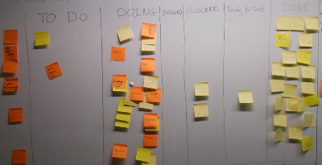
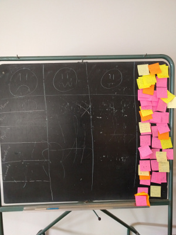

# Rapport d'organisation
_Projet Drone Fireman_

## Introduction

Dans le cadre de notre master 2 Génie Logiciel en Alternance, nous avons été amenés à réaliser un projet avec une volonté de simuler une situation réelle et complète, des spécifications avec le client jusqu'à la présentation des divers livrables. Les objectifs de ce module étaient de nous organiser en auto-gestion tout en suivant la méthodologie Agile qu'est le Scrum.

Dans le cadre de ce projet le client était simulé par M. Plouzeau, le scrum master était M. Ninassi et notre équipe conportait 9 personnes: L. Guerin, G. Gestin, H. Nounou, A. Treimocero, A. Mazure, T. Huchedé, B. Tessiau, M. Lebastard et A. Brezillon.  

Ce projet s'est déroulé en trois phases, une phase d'analyse de la faisabilité, dans laquelle nous n'avions qu'une connaissance très vague des spécifications client. Puis deux sprints de 2 semaines avec présentation des livrables à la fin de chacun d'eux.

## Analyse préliminaire - module SIT

Ce projet a commencé par une phase d'analyse de faisabilité via un module nommé SIT (Système d'information Tactique). L'idée était de tester la faisabilité d'applications mobile affichant des données partagées en temps en réel. Lors de cette phase une partie des technologies et outils nous ont été imposées par l'équipe enseignante, pour les autres nous avons réalisé des études comparative sur ce que nous souhaitions utiliser.

### Sur demande de l'équipe enseignante

#### _Outil de gestion des taches / Wiki_
Nous avons utilisé __Taiga__.
#### _Base de donnée_
Nous avons utilisé MongoDB.
#### _interface mobile_
Nous avons travaillé sur des tablettes __androids__.

### Par étude comparative

#### _Système de gestion de versions_
Le choix s'est porté sur l'outil __Git__ et le gestionnaire de projets __Github__, le projet se voulant open source et l'outil étant connu par l'ensemble de l'équipe.

#### _Outil de communication_
Parmis les outils de messagerie, l'utilisation de mails nous paraissait inadaptée pour une communication rapide et classée par sujet, nous nous sommes donc dirigés vers un outil de chat, __Slack__ possédant de plus des plug-ins nous permettant de monitorer les modifications faites sur les répertoires de code source ainsi que sur l'outil de gestion des taches.

#### _Outil de partage de fichiers_
Nous avons fait le choix d'utiliser __Google Drive__

#### _Outil d'intégration continue_
Le choix a été fait d'utiliser __Jenkins__, de part la connaissance de ce dernier par certains membres de l'équipe et par sa dominance sur le marché de l'intégration continue (connaissance plus facilement valorisable dans le cadre professionnel).

#### _outils de déploiement continue_
Pour gérer le déploiement de manière transparente tant en garantisant une stabilité et une testabilité du système, nous avons fait le choix d'utiliser l'outil de virtualisation __Docker__ et son constructeur de containers __Docker hub__. Ce choix s'est motivé dans une logique d'acquisition de connaissances sur une technologie qui nous paraissait prométeuse.

#### _Serveur REST_
Nous avions besoin d'un serveur permettant l'accès à la base de donnée de manière sécurisée. Pour cela nous avons fait le choix d'un serveur REST programmé en __NodeJS__ ce choix était motivé à la fois par une envie d'acquisition de connaissances sur une technologie méconnue de l'équipe et par la cohérence apportée par ce genre de technologies pour ce genre de service (en effet le nodeJS permet de créer avec très peu de code un serveur cohérent) .

#### _Simulateur de drone_
Dans le cadre du simulateur de drone, souhaitant que la simulation se fasse coté serveur, nous sommes partis sur l'API Python du constructeur du drone fourni par l'équipe enseignante, __DroneKit Python__. l'autre choix étant une API Android, ce qui ne nous paraissait pas pertinent en terme d'architecture.

### Présentation à l'issue du module
Lors de la présentation de fin de module, nous avons validé la faisabilité du projet par l'utilisation de cette stack logicielle, Un élément n'avait malheureusement pas pu être traité dans le temps impartis, la capture d'image via le drone simulé, ce qui nous a posé quelques soucis par la suite. Ceci montre la pertinence d'une étude de faisabilité avant tout démarrage de projet.

## Déroulement du sprint 1
Comme dit précédemment notre projet s'articulait autours de la méthodologie Scrum. Les éléments suivants permettent de comprendre le déroulement du projet sur la période du 18/04/16 au 29/04/16.

### Définition du _product backlog_
Dans un premier temps, nous avons pris connaissance des user stories écrites par le client, nous avons aussi profité de cette réunion pour éclaircir un maximum ces dernières afin d'être sur d'avoir compris les besoins du client.

### Définition et répartition des taches
Le choix des _user stories_ traitées dans ce _sprint_ a été fait conjointement avec le _Scrum master_, puis en autonomie nous avons réalisé la répartition en tâches ainsi qu'un chiffrage théorique de la complexité de ces dernières. Pour ce chiffrage nous avons employé la technique du _planning poker_, nous basant sur la montée en compétences réalisée lors de la phase d'analyse préliminaire afin de nourrir le débat sur la complexité supposée de chaques tâches.

S'en est suivie une répartition de ces dernières ainsi que l'ajout de tâches d'ordre organisationel (mise en place d'une plateforme de déploiement continue ainsi que d'environnements de production et de pré-production).

Afin de permettre une meilleure productivité et une valorisation des montées en compétences liées au module SIT, nous avons fait le choix de spécialiser les développeurs. Affectant proportionnellement à la charge estimée, des personnes sur les tâches liées à la partie android (5), d'autres sur la partie Serveur REST et base de données (2,5) et sur les tâches liées au simulateur de drone (1,5).

D'autre part, nous avons fait le choix de faire évoluer notre architecture afin de faciliter la réalisation des tâches liées au Serveur REST sans conflicts entre les développeurs. En effet, l'architecture mico-service rend indépendants les développements de chaques service, ce qui nous permettait d'assigner un référent pour chacun d'eux.

### Daily meeting
Tout comme la méthodologie SCRUM le prône, nous avons réalisé des réunions journalières se voulant succintes _(stand up meeting)_ dans lesquelles nous expliquions le travail réalisé, les problématiques rencontrées, ainsi que les tâches que nous comptions commencer par la suite.

### Présentation & Rétrospective
A l'issue de ce premier sprint, nous avons présenté au client l'état du projet, ce dernier nous a validé un certains nombre de user stories. Quant aux autres nous avons pris note de ses remarques afin de répercuter les modifications sur le sprint suivant.

Lors de la retrospective nous avons analysé l'organisation mise en place et en avons remarqué les points suivants :

#### pros :
- Stack logicielle cohérente
- Compétences redondées au sein de l'équipe (notamment sur la configuration de Jenkins)

#### cons :
- Suivi des tâches via Taiga mal réalisée
- Tâches pas assez atomiques
- Manque de tests de qualification

## Sprint 2

### Ajustement des outils
Suite à la retrospective, nous avons donc fait le choix d'abandonner l'utilisation de Taiga au profit d'un tableau blanc et de post-its, nous avons aussi mis en place un second tableau contenant l'ensemble des erreurs survenues lors des tests de qualification .

## Synthèse du déroulement
Ce projet nous a permis de nous mettre en situation de projet réel, nous permettant ainsi de monter en compétence sur le travail en équipe de taille assez conséquente, cela change beaucoup dans l'organisation et est donc très enrichissant. Nous pensons avoir réalisé une réelle montée en compétence sur ce point là, constatant une nette évolution dans notre productivité entre le premier et le second sprint.

Il nous a aussi permis de rencontrer des problèmes d'ordre technique que nous avons du palier dans un temps donné relativement court ce qui nous a aidé à gagner en décisionnel.   
Par exemple, le système de notification choisis(GCM) ne réagissait pas comme nous l'avions prévu, après plusieurs modifications sans résultat de notre part, nous avons fait le choix de changer ce composant afin de livrer dans les temps.

Dans un ordre plus général, ce projet nous a surtout permis de travailler sur l'aspect social d'une équipe. Une bonne communication et cohésion d'équipe nous a aidé à gerer les éventuels conflicts qui auraient pu naitre avec le stress inhérent à ce genre d'activités. 
